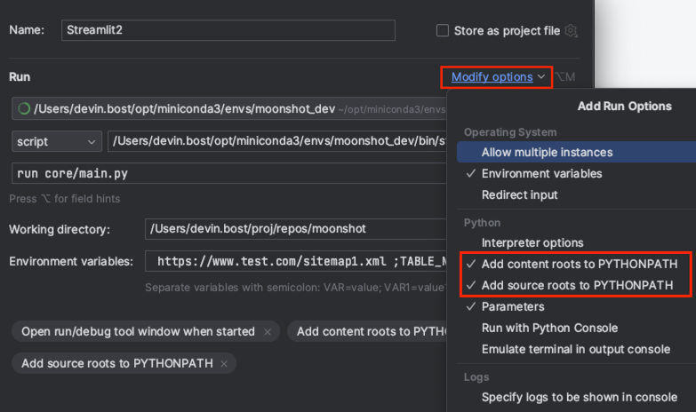
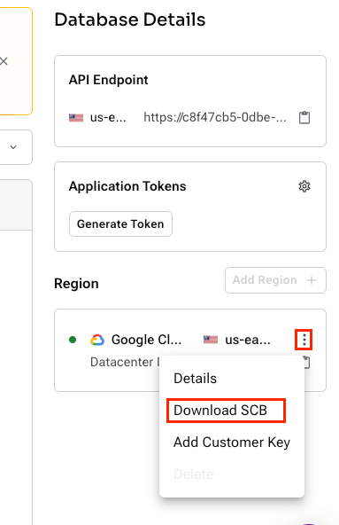

# Moonshot


## Automatic (Zero-code, near Zero-config) Hyperpersonalization

Alpha-stage library that could almost replace your customer support department.
## Features & Roadmap:
- [x] Intelligent information retrieval and summarization for personalized recommendations based on user context
- [x] Automatic detection of relevant user tables
- [x] Automatic table filtering & summarization
- [x] Automatic collection ANN search & summarization
- [x] Web crawler with NLP-based content summarization, keyword extraction, and tagging
- [x] Support for native C* driver and JSON API (Astrapy)
- [x] LangSmith integrated
- [x] Cloud native
- [x] Async
- [ ] ColBERTv2 support (coming soon)
- [ ] Graph neural network enhanced recommendations
- [ ] LangServe compatible
- [ ] Autonomous agent actions
- [ ] Kubernetes native
- [ ] REST API support
- [ ] Multi-modal interactivity
- [ ] Flow visualization and admin control
- [ ] TLS, JWT Token-based auth, and RBAC w/ delegated management
- [ ] Intelligent document discovery and automatic mapping/ingestion
- [ ] Automatic query and LLM error handling & self-correction
- [ ] Real-time data discovery
- [ ] Graph-based prompt construction
- [ ] Automatic data ingestion from S3, GCP Cloud Storage, and Azure Blob Storage
- [ ] VertexAI support

## Hyperpersonalization architecture:


## Contributing
Start by walking through the code in this method: [Personalization flow](https://github.com/devinbost/moonshot/blob/a62c38e8c68e88d78545797560cf3e760d17f87e/Chatbot.py#L178) 

## Feedback welcome!
We'd love to get feedback on what we can do to improve this library. 
Feedback should be created as Issues on this github repo.

Don't forget to **star this repo**!
### Usage:
Start from UserInterface.py

Most easily navigated in PyCharm

Reach out to Devin for more info if interested.

## Setup

### Steps to get running:

#### Clone repo and cd into it:
```commandline
git clone git@github.com:devinbost/moonshot.git
cd moonshot
```

#### Install Conda:
You can install via graphical installer for Miniconda here: https://docs.anaconda.com/free/miniconda/miniconda-install/

#### Setup conda environment
```commandline
conda create -n moonshot_dev python=3.11.7 pip 
```
```commandline
conda activate moonshot_dev
pip install -r requirements.txt
```

### Setup Astra DB

#### Create AstraDB account
Setup your free AstraDB account if you haven't already done so.
https://astra.datastax.com/signup

#### Create a new vector database
After creating your Astra account, click the button to create a new database.


Ensure that Vector is selected, and fill out the form with your desired name, provider and region.


Then, click Create Database. That's it! You now have an Astra DB with vector enabled!

### Run starter script

A CQL script has been provided (`scripts/setup_tables.cql`) with some starter data that you can run in AstraDB.

To run this script, open your Astra portal, navigate to your database, and click the CQL Console button:

In the example script, we assume your namespace is named "default_namespace". 

Copy and paste the contents into the CQL prompt. 

## Configuring PyCharm:
Add interpreter:


Select the new conda environment and click OK:


Create a new runtime configuration for running Streamlit:


Click + sign to add new Python configuration:


Set your env and bin path to point to the new environment.
Also, be sure to set `run core/main.py` and set your working directory to where your repo is running from.


Make sure that the content and source roots are added to PYTHONPATH so you don't run into import problems.
You can set those here:


You can ignore the Environment variables section because all configs are now stored in config/config.yaml

Apply the changes and click OK.

### Setup your configs
Some configs are used by `core/VectorStoreFactory.py` to setup the drivers for the different experiences we will use in this workshop.
Other configs are loaded by `core/ConfigLoader.py` and used by `core/LLMFactory.py` to setup your LLM(s).
At a minimum, you will need:
- `ASTRA_TOKEN`
- `ASTRA_ENDPOINT`
- `SECURE_BUNDLE_PATH` (explained below)

The Astra token and endpoint can be obtained from your Astra portal:


To make use of the text2cql feature of this library (not optional), you will also need to specify:
- `SECURE_BUNDLE_PATH`
which should be the absolute path to a directory containing the secure bundle, which you can download here:


We recommend creating a directory named "scratch" in this repo and storing the secure bundle there.
This directory is currently specified in .gitignore as an ignored directory to prevent repo commits from accidentally including the secure bundle.

If using OpenAI, you will also need to define:
- `OPENAI_API_KEY`
If using IBM watsonx, you will need to define:
- `IBM_API_SECRET`
- `IBM_PROJECT_ID`

These can be obtained by following the instructions provided by those platforms.

Optionally, if you want integration with LangSmith, you will want to add these variables:
- `LANGCHAIN_API_KEY`
- `LANGCHAIN_ENDPOINT`
- `LANGCHAIN_PROJECT`
- `LANGCHAIN_TRACING_V2` (set to "true")
These LangSmith variable values can be obtained as per LangChain documentation.

#### Put the values into config.yaml
Create a directory named `config` and create config.yaml file in that directory.


Below is an example of what your config.yaml file needs to look like. Only include the sections that are relevant.
For example, if you're using Azure, you will want to specify (at a minimum):

```yaml
astradb:
  ASTRA_TOKEN: "AstraCS:"
  ASTRA_ENDPOINT: "https://....apps.astra.datastax.com"
  SECURE_BUNDLE_PATH: "/absolute/path/to/secure-connect.zip"
llm:
  azure:
    required:
      AZURE_OPENAI_API_KEY: "mykey"
      AZURE_OPENAI_ENDPOINT: "https://example.openai.azure.com/"
      OPENAI_API_VERSION: "2023-05-15"
      AZURE_DEPLOYMENT: "example-gpt-4"
    optional:
      AZURE_MODEL_VERSION: "your_azure_model_version"
embedding:
  azure:
    required:
      AZURE_DEPLOYMENT: "example-embeddings"
      OPENAI_API_VERSION: "2023-05-15"
```
Any additional configs provided will allow you to swap your LLM and embeddings in the UI.
Here is a more complete example that supports more LLMs and embeddings:

```yaml
astradb:
  ASTRA_TOKEN: "AstraCS:"
  ASTRA_ENDPOINT: "https://....apps.astra.datastax.com"
  SECURE_BUNDLE_PATH: "/absolute/path/to/secure-connect.zip"
llm:
  azure:
    required:
      AZURE_OPENAI_API_KEY: "mykey"
      AZURE_OPENAI_ENDPOINT: "https://example.openai.azure.com/"
      OPENAI_API_VERSION: "2023-05-15"
      AZURE_DEPLOYMENT: "example-gpt-4"
    optional:
      AZURE_MODEL_VERSION: "your_azure_model_version"
  openai:
    required:
      OPENAI_API_KEY: "mysecret"
      MODEL_NAME: "gpt-4-1106-preview"
  watsonx:
    required:
      IBM_API_SECRET: "mysecret"
      IBM_PROJECT_ID: "my-id"
langsmith:
  required:
    LANGCHAIN_API_KEY: "mykey"
    LANGCHAIN_ENDPOINT: "https://api.smith.langchain.com"
    LANGCHAIN_PROJECT: "myproject"
    LANGCHAIN_TRACING_V2: "true"

embedding:
  azure:
    required:
      AZURE_DEPLOYMENT: "example-embeddings"
      OPENAI_API_VERSION: "2023-05-15"
  huggingface:
    required:
      MODEL_NAME: "all-MiniLM-L12-v2"
```

## Research influences:
From the work of Dong, X. et al. (2023), the most common source of errors was incorrect selection of table or column names. 
For this reason, we used a semi-structured approach to code generation where we used a hybrid approach that combined:
1. a specific prompt/chain for determining relevant tables 
2. a semi-structured approach where some of the code body was already provided
This hybrid approach is easier to control for security and auth purposes as well since authorization can be checked before code is executed.

Dong, X., Zhang, C., Ge, Y., Mao, Y., Gao, Y., Lin, J., & Lou, D. (2023). C3: Zero-shot Text-to-SQL with ChatGPT. arXiv preprint arXiv:2307.07306.

---
